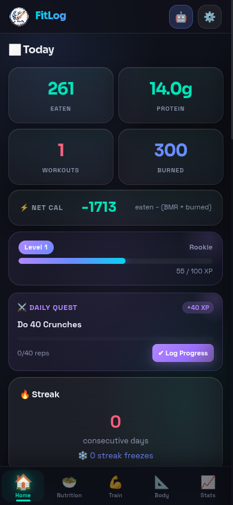
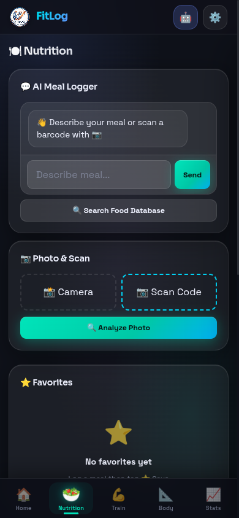
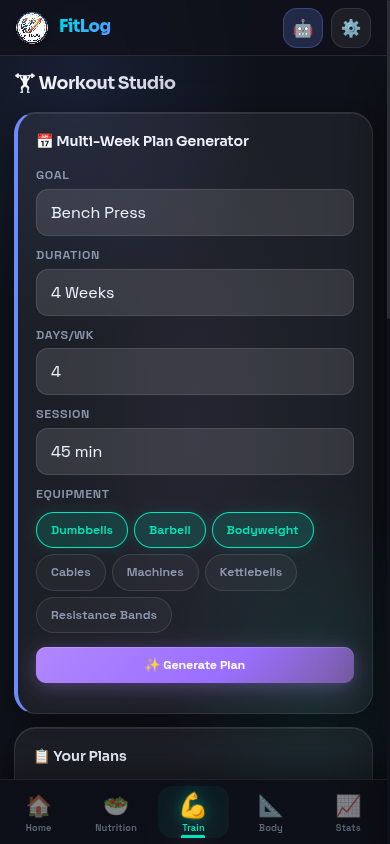
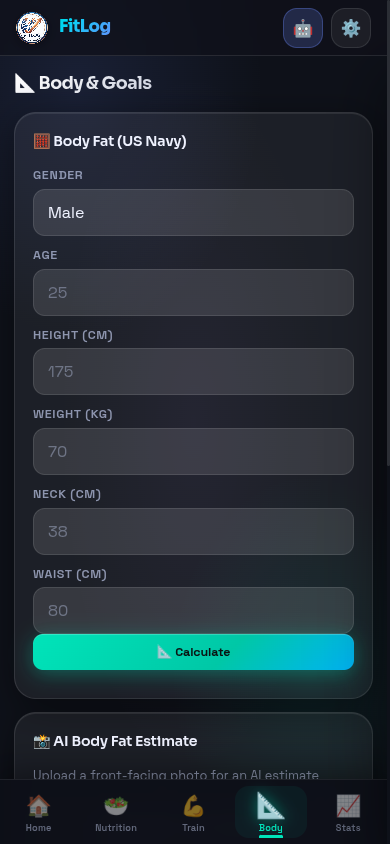
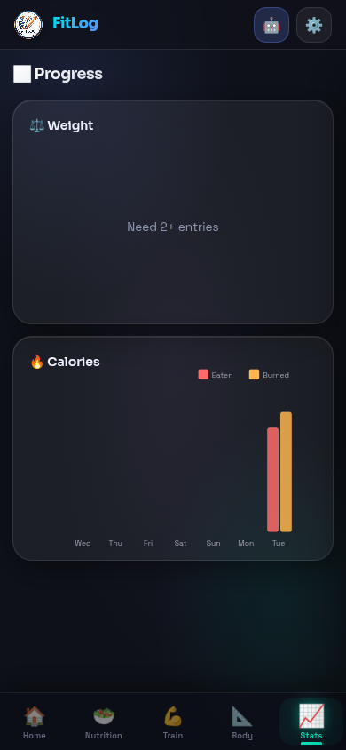
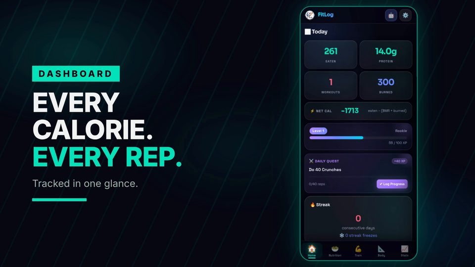

# FitLog v2.1

> AI-Powered Fitness & Nutrition Tracker

A single-page web application for tracking workouts, nutrition, body metrics, and generating personalized workout plans using Google Gemini AI.

Live at: https://touhidsiddiqueeraj-bit.github.io/FitLog-2.0/

## ✨ Features

- **📊 Dashboard** — Daily calories, protein, workouts, streak tracking, steps, hydration, and weight
- **🔥 Streak System** — Consecutive workout days with streak freezes
  - Freezes = 7 - days/week selected in plan
  - Uses freeze when missing non-rest days
- **🍽️ Nutrition Logging**
  - AI chat to describe meals
  - Barcode scanning (Open Food Facts API)
  - Photo-based meal analysis
  - Favorites for quick logging
- **🏋️ Workout Studio**
  - AI-generated multi-week workout plans
  - **Plan Preview** — Review AI-generated plans before accepting
  - **Edit Mode** — Modify exercises, sets, reps per day
  - **Exercise Picker** — Swap exercises with searchable list
  - **AI Regenerate** — Regenerate any single day with AI
  - **Start/Stop** — Pause or stop active plans
  - Quick workout generator
  - GIF demonstrations for exercises
  - Manual workout logging
- **📐 Body Metrics**
  - US Navy body fat calculator
  - AI body fat estimation from photos
  - TDEE & macro calculator
- **📈 Progress Charts**
  - Weight tracking over time
  - Weekly calorie intake vs burned

## 📱 Screenshots

| Dashboard | Nutrition | Train |
|---|---|---|
|  |  |  |

| Body | Stats |
|---|---|
|  |  |

## 🎬 Trailer

29 seconds, voiceover + 132 BPM workout beat, all five screens:

⬆️ Click the poster to play [`fitlog-trailer-final.mp4`](videos/fitlog-trailer/renders/fitlog-trailer-final.mp4)

## 🚀 Quick Start

1. Open `index.html` in any modern browser
2. Get a free API key from [Google AI Studio](https://aistudio.google.com/apikey)
3. Click ⚙️ (Settings) and paste your API key
4. Start tracking!

### No installation required — runs entirely in the browser.

## 🔑 API Key Setup

1. Go to [Google AI Studio](https://aistudio.google.com/apikey)
2. Create a new API key (free tier available)
3. In FitLog, click the ⚙️ Settings icon
4. Paste your key and save

The API key is stored locally in your browser and never sent to any server except Google's.

## 🛠️ Tech Stack
- **LocalStorage** — Data persists in your browser
- **Google Gemini API** — AI-powered meal & workout generation
- **Open Food Facts API** — Barcode food lookup
- *

## 📱 Browser Support

- Chrome, Firefox, Safari, Edge (latest versions)
- Mobile-responsive design
- Dark & Light theme support

## 🔐 Privacy

- All data stored locally in your browser
- API key stays on your device
- Nothing is sent to external servers except:
  - Google Gemini API (when you use AI features)
  - Open Food Facts (for barcode lookup)

## 📄 License

**Copyright © 2026 — All rights reserved.**

This software is licensed for **personal, non-commercial use only**.

- ✅ You may use this software for personal purposes
- ✅ You may modify and adapt it for your own use
- ❌ You may NOT use this software for commercial purposes
- ❌ You may NOT sell, distribute, or monetize this software

---

Built with ❤️ for fitness enthusiasts
